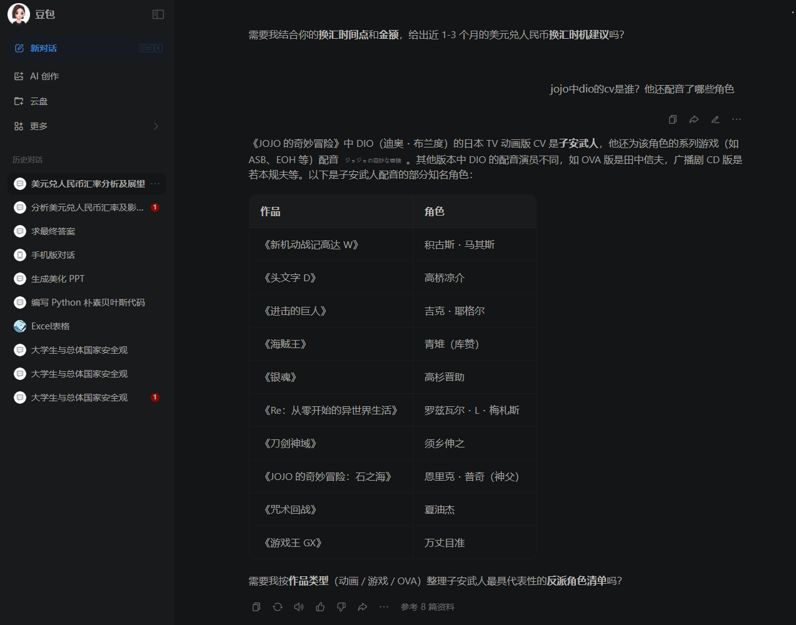
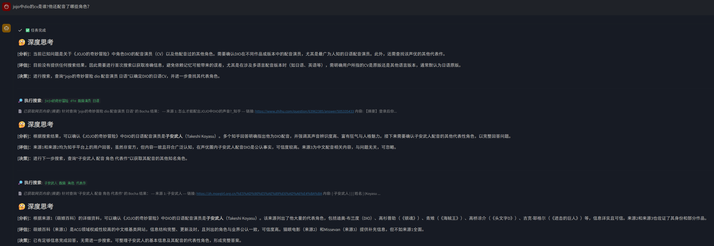
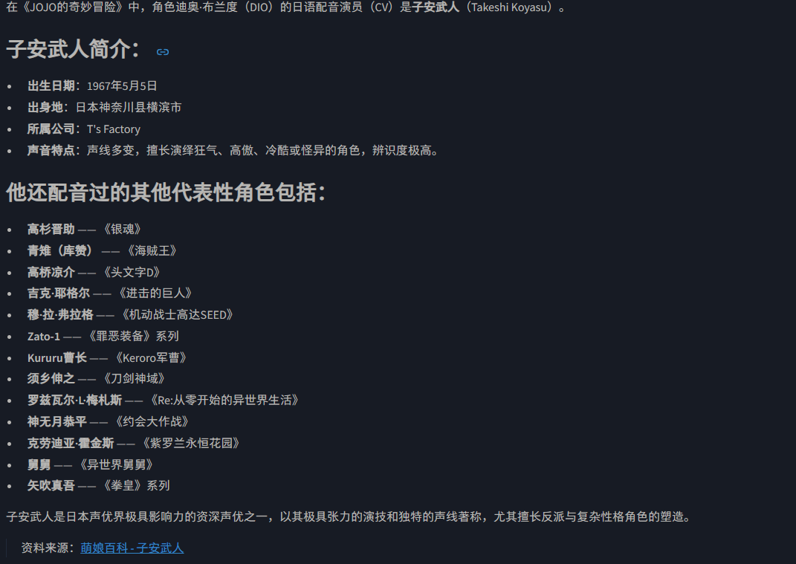
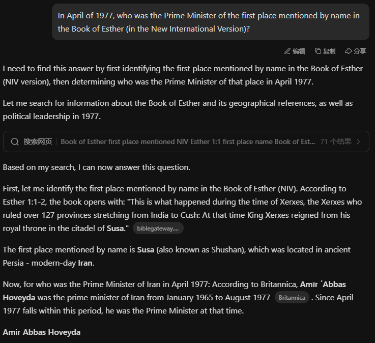
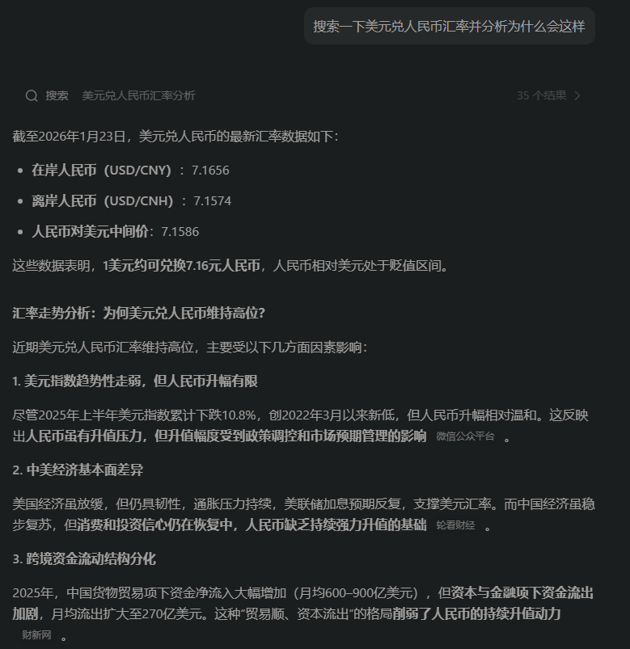
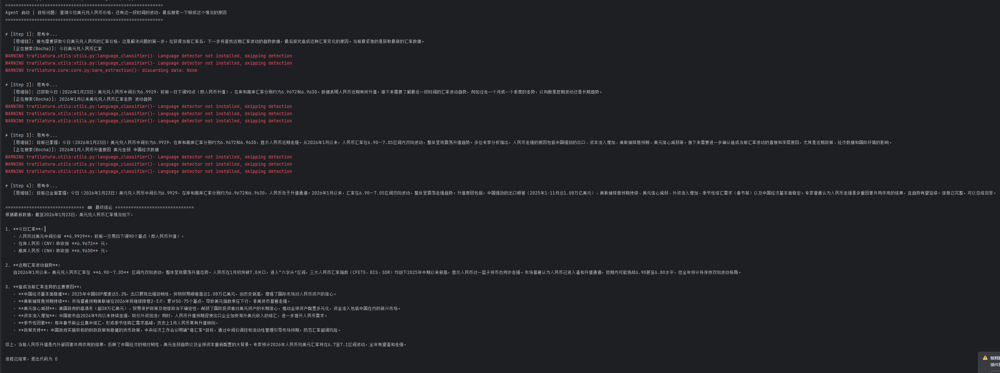
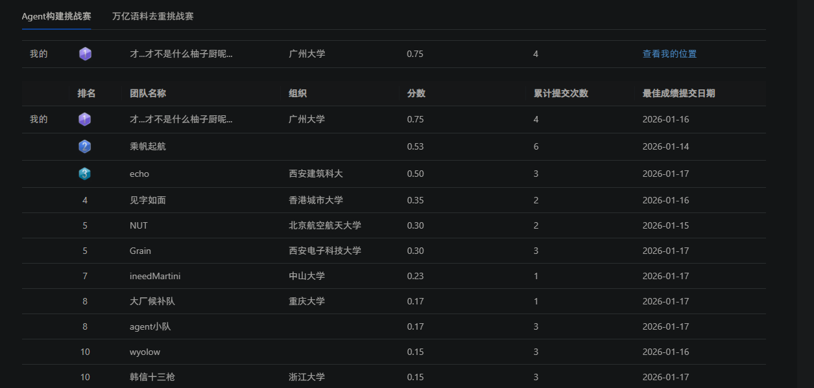

# DeepRecursive-Search: 解决 LLM 潜搜索幻觉的递归式多步深度搜索智能体

## 😡一些平台让人红温的点/就本人使用体验而言（搞这个项目的原因）

当前主流的大模型平台（如 Kimi、豆包、DeepSeek 等）虽然接入了联网搜索功能，但在处理复杂问题时常面临**搜索深度不足**和**幻觉**问题，主要体现在以下两种模式的局限性：

1.  **单步搜索（Single-Step）：** 往往仅在第一步进行联网搜索，后续步骤单纯依赖模型原有知识进行推理。这导致在需要多层级信息验证时，模型容易产生幻觉。
2.  **笼统搜索（Vague Search）：** 模型倾向于将整段长文本总结为一串关键词进行一次性搜索。由于缺乏逻辑拆解，搜索结果往往缺乏精度，无法覆盖复杂问题的各个方面。
3.  **搜索敏感：** 平台限制过于严格，可能因为一些敏感字眼直接中断推理，其实这些字眼在当下的搜索环境并非什么违规点。

##  核心

本项目旨在**将思考的主导权交还给智能体（Agent）**。通过递归式的推理逻辑，模型能够像人类专家一样，将复杂问题拆解为多个逻辑步骤，并在每一步根据上下文自由决定是继续搜索资料还是汇总信息。

### 主要特性
*   **逻辑拆解与多步执行：** 摒弃“一次搜索定终身”，针对复杂问题进行分步检索。
*   **深度网页访问：** 不仅停留在搜索引擎摘要，更可进一步访问目标网页及子网页，获取详尽内容。
*   **递归式推理（Recursive Reasoning）：**
    *   采用 **JSONL 函数调用** 机制，让模型自我迭代。
    *   模型在每一步自行判断分支路径：是调用工具继续 `Search`，还是认为信息充足进行 `Summarize`（递归出口）。
    *   **优势：** 相比于固定流程的浅层搜索，这种动态决策机制能达到极深的搜索深度。

##  技术实现原理

### 1. 高效的数据获取
*   **关键词检索：** 利用各大搜索 API 获取初步摘要。
*   **深度爬取：** 集成 Python 的 `trafilatura` 库。该库在解析网页具体内容时表现优异，且相比传统爬虫更不易触发反爬机制，确保数据获取的稳定性。

### 2. 递归智能体架构
*   基于 OpenAI 格式接入 LLM。
*   通过 Prompt Engineering 和 Function Calling，构建一个循环系统，直到模型判定已获得“最好的答案”才停止递归并输出结果。

## 对比（在需要多步搜索的情景下与豆包kimi等国产ai的app进行对比）
### 1.首先是问题（比较简单的搜索推理）：jojo中dio的cv是谁?他还配音了哪些角色？
* 豆包的回答（老二次元一看就知道有问题）
* 
* drs的回答
* 
* 
### 2.问题（复杂搜索情况下推理）:In April of 1977, who was the Prime Minister of the first place mentioned by name in the Book of Esther (in the New International Version)?
* 首先补充背景这个第一句话是从印度到古实，所以是印度
* kimi 的回答（kimi以为是伊朗的，因为理所当然历史发生背景在当今伊朗境内）：
* 
* drs的回答
* 
### 3.问题（时效性多步推理搜索分析）:搜索一下美元兑人民币汇率并分析为什么会这样
* kimi 的回答
* 
* drs 的回答
* 
### 4.本项目使用阿里云天天池搜索agent比赛获得第一的准确率（截至测试时）
* 


---

##  项目模块

本项目提供 **Function SDK** 和 **GUI 桌面版** 两种形态，满足不同开发者的需求。

### 1. 函数开发版 (Function SDK)
适用于开发者集成到自己的应用中。基于 OpenAI 接口格式，只需配置 API Key 即可调用。

**支持的搜索引擎服务：**

| 服务商 | 特性 | 成本/限制 | 备注 |
| :--- | :--- | :--- | :--- |
| **Google Search** | 搜索质量最高 | 免费 (100次/天) | **推荐**，需科学上网环境 |
| **博查 (Bocha)** | 国内可用 | 注册赠 1000 次 | 后续约 ¥3.00 / 1000次 |
| **DuckDuckGo** | 隐私保护 | 免费 | 国内访问不稳定，易被反爬 |

### 2. GUI 桌面版 (Desktop Client)
开箱即用，适合直接进行深度研究的用户。

*   **一键配置：** 填入 API Key 即可开始工作，集成了上述三种搜索源。
*   **思维链可视化 (CoT)：** 完整展示智能体的思考过程、搜索关键词选择及逻辑跳转（类似于 Google AI Studio 的深度展示）。
*   **信源引用：** 每一个结论都提供明确的参考资料来源（Reference）。
*   **结果对比：** 相比市面上仅做笼统搜索的 App，本客户端提供真正的深度研究报告。

---

##  快速开始

### 环境要求
*   Python 3.8+
*   OpenAI API 兼容的 LLM 服务商 Key
*   搜索服务商 API Key

相关依赖
```bash
pip install streamlit requests trafilatura openai duckduckgo-search
#项目二如何启动
streamlit run app.py
```

##  效果对比

| 维度 | 传统 LLM 联网 (Kimi/豆包等) | **本项目 (DeepRecursive)** |
| :--- | :--- | :--- |
| **搜索逻辑** | 单次查询 / 关键词堆砌 | **递归拆解 / 逻辑分步** |
| **内容深度** | 仅依赖搜索摘要 | **深入爬取网页正文** |
| **幻觉控制** | 后半段推理易产生幻觉 | **每一步均基于实时检索数据** |
| **透明度** | 黑盒处理 | **完整展示思维链与来源** |

---

> **注意：** 本项目致力于解决复杂问题的深度调研，由于递归搜索需要多次网络请求和模型推理，响应速度会慢于传统单步搜索，但在准确性和深度上具有显著优势。
